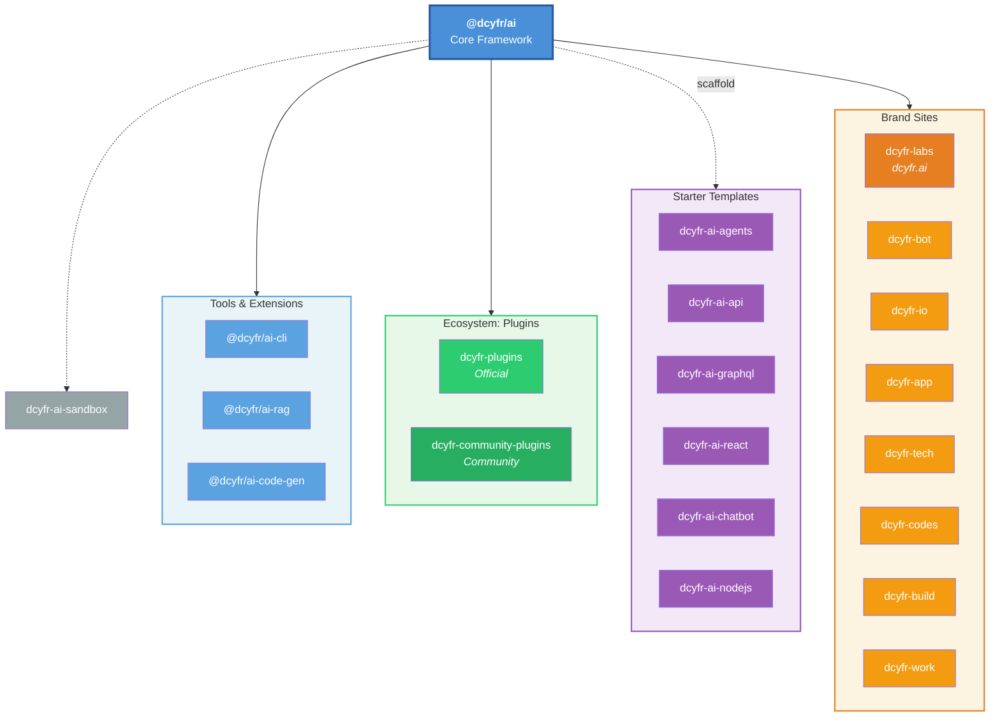

# DCYFR Labs

> Secure, innovative solutions for the modern web. Cyber architecture and design.

DCYFR Labs builds and maintains open-source projects focused on **modern security**, **agentic AI**, and **developer workflows**. The flagship is the [`@dcyfr/ai`](https://github.com/dcyfr-labs/dcyfr-ai) framework — a portable AI agent harness with a plugin architecture, deployed in production at [dcyfr.ai](https://www.dcyfr.ai).

## 🏗️ How it fits together

## 📦 Core framework

Published on [npm](https://www.npmjs.com/org/dcyfr) — install with npm/yarn/pnpm/bun:

| Package | Version | Description | Install |
|---------|---------|-------------|---------|
| [`@dcyfr/ai`](https://github.com/dcyfr-labs/dcyfr-ai) |  | Portable AI agent harness with plugin architecture | `npm i @dcyfr/ai` |
| [`@dcyfr/ai-cli`](https://github.com/dcyfr-labs/dcyfr-ai-cli) |  | Cross-platform CLI for the DCYFR framework | `npm i -g @dcyfr/ai-cli` |
| [`@dcyfr/ai-rag`](https://github.com/dcyfr-labs/dcyfr-ai-rag) |  | RAG framework — loaders, embeddings, vector stores | `npm i @dcyfr/ai-rag` |
| [`@dcyfr/ai-code-gen`](https://github.com/dcyfr-labs/dcyfr-ai-code-gen) |  | AI-powered code generation with AST manipulation | `npm i @dcyfr/ai-code-gen` |

## 🚀 Starter templates

Clone directly or use GitHub's **"Use this template"** button:

| I want to... | Template | Stack |
|--------------|----------|-------|
| **Build autonomous agents** | [dcyfr-ai-agents](https://github.com/dcyfr-labs/dcyfr-ai-agents) | Node 20+, TypeScript, tool use, memory |
| **Build a REST API** | [dcyfr-ai-api](https://github.com/dcyfr-labs/dcyfr-ai-api) | Express 5, Drizzle ORM, JWT, OpenAPI |
| **Build a GraphQL API** | [dcyfr-ai-graphql](https://github.com/dcyfr-labs/dcyfr-ai-graphql) | Apollo Server 4, schema-first, type-safe |
| **Build a React SPA** | [dcyfr-ai-react](https://github.com/dcyfr-labs/dcyfr-ai-react) | React 19, Vite, TanStack, Zustand, Shadcn/ui |
| **Build a chatbot** | [dcyfr-ai-chatbot](https://github.com/dcyfr-labs/dcyfr-ai-chatbot) | Multi-turn conversations, streaming |
| **Node.js web server** | [dcyfr-ai-nodejs](https://github.com/dcyfr-labs/dcyfr-ai-nodejs) | Node 24+, TypeScript strict, 80%+ coverage |

Deprecated templates (still usable, no longer maintained)

| Template | Deprecated | Notes |
|----------|-----------|-------|
| [dcyfr-ai-web](https://github.com/dcyfr-labs/dcyfr-ai-web) | Feb 2026 | Full-stack Next.js — deprecated on npm, still works as template |
| [dcyfr-ai-docker](https://github.com/dcyfr-labs/dcyfr-ai-docker) | Feb 2026 | Docker containerization — template, not a library |
| [dcyfr-ai-kubernetes](https://github.com/dcyfr-labs/dcyfr-ai-kubernetes) | Feb 2026 | Consolidated into agent knowledge; see Pulumi/CDK8s/Helm |
| [dcyfr-ai-notebooks](https://github.com/dcyfr-labs/dcyfr-ai-notebooks) | Feb 2026 | No longer maintained; see Observable, Jupyter, Hex |

## 🔌 Plugin ecosystem

Extend `@dcyfr/ai` with curated or community plugins:

| Registry | Scope | Security |
|----------|-------|----------|
| [dcyfr-plugins](https://github.com/dcyfr-labs/dcyfr-plugins) | Official, curated | ✅ Security-scanned, trust-scored |
| [dcyfr-community-plugins](https://github.com/dcyfr-labs/dcyfr-community-plugins) | Community | ⚠️ Auto-scanned, unaudited |

## 🌐 Web properties

| Domain | Repo | Purpose | Status |
|--------|------|---------|--------|
| [dcyfr.ai](https://www.dcyfr.ai) | [dcyfr-labs](https://github.com/dcyfr-labs/dcyfr-labs) | Blog, portfolio, reference architecture | 🟢 Live |
| dcyfr.io | [dcyfr-io](https://github.com/dcyfr-labs/dcyfr-io) | Product ecosystem control center | 🔵 Planned |
| dcyfr.app | [dcyfr-app](https://github.com/dcyfr-labs/dcyfr-app) | Interactive template showcase | 🔵 Planned |
| dcyfr.tech | [dcyfr-tech](https://github.com/dcyfr-labs/dcyfr-tech) | Research hub & whitepapers | 🔵 Planned |
| dcyfr.codes | [dcyfr-codes](https://github.com/dcyfr-labs/dcyfr-codes) | Searchable code patterns & recipes | 🔵 Planned |
| dcyfr.bot | [dcyfr-bot](https://github.com/dcyfr-labs/dcyfr-bot) | Bot marketplace | 🔵 Planned |
| dcyfr.build | [dcyfr-build](https://github.com/dcyfr-labs/dcyfr-build) | Build tools hub | 🔵 Planned |
| dcyfr.work | [dcyfr-work](https://github.com/dcyfr-labs/dcyfr-work) | Work portal | 🔵 Planned |

## 🧪 Sandbox & internal

| Repo | Purpose |
|------|---------|
| [dcyfr-ai-sandbox](https://github.com/dcyfr-labs/dcyfr-ai-sandbox) | Testing and benchmarking playground for `@dcyfr/ai` |
| [dcyfr-ai-agents](https://github.com/dcyfr-labs/dcyfr-ai-agents) | DCYFR-specific agent profiles (template + private agents) |
| [dcyfr-workspace-agents](https://github.com/dcyfr-labs/dcyfr-workspace-agents) | Agent catalog and configuration repo |
| [dcyfr-labs-registry](https://github.com/dcyfr-labs/dcyfr-labs-registry) | Internal package registry tooling |
| [dcyfr-workspace-cron-jobs](https://github.com/dcyfr-labs/dcyfr-workspace-cron-jobs) | Scheduled automation jobs |
| [dcyfr-workspace-automation](https://github.com/dcyfr-labs/dcyfr-workspace-automation) | Workspace automation infrastructure |

## 🤝 Contributing

Each repo has its own contributing guide. In general:

- **Bug reports** — Open an issue on the relevant repo
- **Feature requests** — Start a [discussion](https://github.com/dcyfr-labs/dcyfr-ai/discussions) on `dcyfr-ai`
- **Plugin submissions** — See [`dcyfr-community-plugins`](https://github.com/dcyfr-labs/dcyfr-community-plugins)
- **Security issues** — See [Security](#-security) below — do **not** open public issues for vulnerabilities

## 🔒 Security

All DCYFR Labs packages follow responsible disclosure. Report vulnerabilities via [SECURITY.md](https://github.com/dcyfr-labs/dcyfr-ai/blob/main/SECURITY.md) or email **security@dcyfr.ai**.

## 📬 Connect

- Website: [dcyfr.ai](https://www.dcyfr.ai)
- npm org: [@dcyfr](https://www.npmjs.com/org/dcyfr)
- Repositories: https://github.com/orgs/dcyfr-labs/repositories
